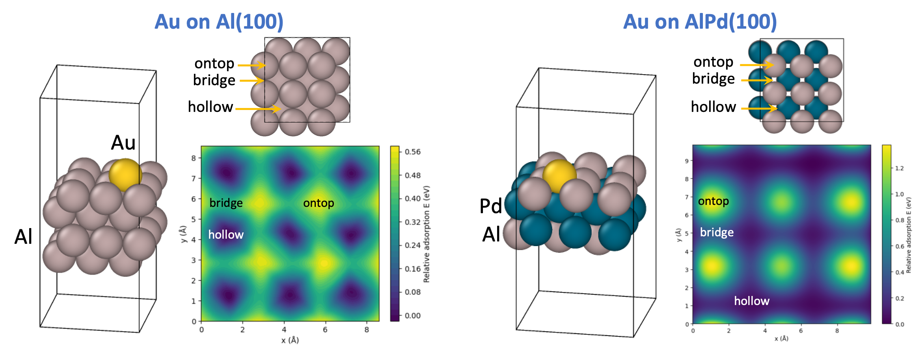

# ChemDX_NEB_MLIP

Machine Learning Interatomic Potential (MLIP) project using the ChemDX database

🏆 Developed as part of the **KRICT ChemDX Hackathon 2025**

---

## 🧠 Motivation

> **Can we systematically supply missing data that greatly improves MLIPs?**

- Many machine learning interatomic potentials (MLIPs) struggle with **poor transferability and instability** when simulations explore configurations far from equilibrium. Traditional datasets are heavily biased toward near-equilibrium or randomly-perturbed structures, leaving **transition states and reaction pathways underrepresented**.

- This project investigates whether explicitly adding **minimum energy path (MEP) data from Nudged Elastic Band (NEB) calculations** can systematically enhance MLIP performance, particularly for **dynamic simulations**.

<p align="center">
  
</p>

---

## ⚙️ Systems Studied

We focused on surface adsorption systems:

| System | Surface Type | Adsorbate | Stable Site |
|--------|--------------|-----------|-------------|
| Au on Al(100) | Pure metal surface | Au | Hollow |
| Au on AlPd(100) | Alloy surface | Au | Hollow |

These systems provide well-defined diffusion pathways that are ideal for evaluating the impact of NEB data on MLIP performance.

<p align="center">
  
</p>

---

## 🔬 Approach Overview

### 1️⃣ Data Generation
Atomic configurations were generated using **ASE** with three complementary sampling strategies:

| Method | Purpose | Configuration Type |
|-------|---------|--------------------|
| Relaxation | Stable geometries | Energy minima |
| Molecular Dynamics (MD) | Thermal fluctuations | Near-equilibrium |
| **NEB** | Diffusion pathways | **Saddle points & transition states** |

Two datasets were constructed:

| Dataset | Sampling Methods | Configuration Space Coverage |
|---------|------------------|-------------------------------|
| **Set #1** | Relaxation + MD | Near-equilibrium only |
| **Set #2** | Relaxation + MD + **NEB** | Near-equilibrium + saddle points |

### 2️⃣ MLIP Training
We trained neural network potentials using the **Atomistic Machine-learning Package (AMP)**.

| Model | Training Data | Purpose |
|-------|--------------|---------|
| Model #1 | Set #1 (Relax + MD) | Baseline MLIP |
| Model #2 | Set #2 (Relax + MD + **NEB**) | NEB-enhanced MLIP |

Both models used identical network architectures to ensure that **performance differences arise from data quality, not model complexity**.

<p align="center">
  
</p>

### 3️⃣ Model Evaluation
Models were evaluated using **ANN-driven Molecular Dynamics simulations**.

Evaluation metrics included:

- Force prediction error
- Energy conservation during MD
- Structural stability under finite temperature simulations

---

## 📈 Key Results

### 🧩 Dataset Impact
Including NEB configurations significantly expands coverage of **high-energy and transition-state regions**, which are missing in conventional MD-only datasets.

- [Tutorial: Au on Al(100) data generation](https://colab.research.google.com/github/InWonYeu/ChemDX_NEB_MLIP/blob/master/jupyter_notebook/Au_on_Al/01_data_generation.ipynb)
- [Tutorial: Au on AlPd(100) data generation](https://colab.research.google.com/github/InWonYeu/ChemDX_NEB_MLIP/blob/master/jupyter_notebook/Au_on_AlPd/01_data_generation.ipynb)
  
<p align="center">
  
</p>

### ⚛️ Force Prediction Accuracy and MD Stability
The NEB-enhanced MLIP demonstrated:

- Lower force errors **even for MD trajectories without diffusion process**
- Stable long MD trajectories
- Proper energy conservation

| Model Type         | Force Error | Energy Conservation |
|--------------------|-------------|----------------------|
| Relax + MD           | High        | ❌                    |
| Relax + MD + **NEB**       | Low         | ✅                    |

- [Tutorial: Au on Al(100) trained on set 1](https://colab.research.google.com/github/InWonYeu/ChemDX_NEB_MLIP/blob/master/jupyter_notebook/Au_on_Al/02_training_MD_set_1.ipynb)
- [Tutorial: Au on Al(100) trained on set 2](https://colab.research.google.com/github/InWonYeu/ChemDX_NEB_MLIP/blob/master/jupyter_notebook/Au_on_Al/02_training_MD_set_2.ipynb)
- [Tutorial: Au on AlPd(100) trained on set 1](https://colab.research.google.com/github/InWonYeu/ChemDX_NEB_MLIP/blob/master/jupyter_notebook/Au_on_AlPd/02_training_MD_set_1.ipynb)
- [Tutorial: Au on AlPd(100) trained on set 2](https://colab.research.google.com/github/InWonYeu/ChemDX_NEB_MLIP/blob/master/jupyter_notebook/Au_on_AlPd/02_training_MD_set_2.ipynb)

<p align="center">
  
</p>

---

## 🧠 Key Insight

> **Strategically adding transition-state data can be more effective than increasing model size.**

This work highlights a **data-centric pathway** to improving MLIPs: identifying physically important but under-sampled regions (like saddle points) and systematically incorporating them into the training set.

---

## 🛠 Tools Used

| Tool | Role |
|------|------|
| [**ASE**](https://ase-lib.org/) | Structure generation, Relaxation, MD, NEB |
| [**AMP**](https://amp.readthedocs.io/en/latest/) | Neural network potential training |
| **ChemDX Database** | Initial structures and metadata |
| Python | Workflow orchestration |
| NumPy / Matplotlib | Data analysis and visualization |

---

## 📂 Repository Structure

```
jupyter_notebook/
 ├── Au_on_Al/
 │    ├── 01_data_generation.ipynb
 │    ├── 02_training_MD_set_1.ipynb
 │    └── 02_training_MD_set_2.ipynb
 │
 ├── Au_on_AlPd/
 │    ├── 01_data_generation.ipynb
 │    ├── 02_training_MD_set_1.ipynb
 │    └── 02_training_MD_set_2.ipynb

docs/images/        # Figures and animations used in README
```

---

## 🚀 How to Reproduce

1. Install dependencies
2. Run data generation notebooks
3. Train MLIP models for Set #1 and Set #2
4. Run MD evaluation notebooks to compare stability and accuracy

---

## 🔍 Conclusion

Adding NEB-based transition-state data leads to substantial improvements in MLIP performance by:

- Expanding configuration space coverage
- Reducing force errors in off-equilibrium regions
- Enabling stable and physically reliable MD simulations

This demonstrates that **targeted data augmentation** is a powerful strategy for building more transferable and stable ML interatomic potentials.

---

## 🙏 Acknowledgments

Developed during the **KRICT ChemDX Hackathon 2025**.  
We thank the ChemDX team for organizing the event and providing access to the database.

---

## 📬 Contact

For questions or contributions, please contact:  
- **In Won Yeu** (GitHub: [@InWonYeu](https://github.com/InWonYeu))
- **Jaeseon Kim** (GitHub: [@kasee0](https://github.com/kasee0))
- **Seojin Jeon** (GitHub: [@sjjeon6783](https://github.com/sjjeon6783))
